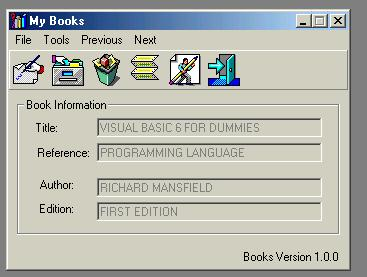



## Books

### Description

This simple database will save all your books collection, it shows the use of ADO, DataReport and DataEnvironment, it shows how to Add, Save, Edit, Delete, View Reports. Other cool stuff it contains a toolbar and a file menu. It also shows the enable and disable functions.
 
### More Info
 

             |
---                |---
**Submitted On**   |2002-03-27 11:52:38
**By**             |[helson morales](https://github.com/Planet-Source-Code/PSCIndex/blob/master/ByAuthor/helson-morales.md)
**Level**          |Intermediate
**User Rating**    |3.8 (19 globes from 5 users)
**Compatibility**  |VB 6\.0, VBA MS Access
**Category**       |[Databases/ Data Access/ DAO/ ADO](https://github.com/Planet-Source-Code/PSCIndex/blob/master/ByCategory/databases-data-access-dao-ado__1-6.md)
**World**          |[Visual Basic](https://github.com/Planet-Source-Code/PSCIndex/blob/master/ByWorld/visual-basic.md)
**Archive File**   |[Books661123282002\.zip](https://github.com/Planet-Source-Code/helson-morales-books__1-33143/archive/master.zip)

